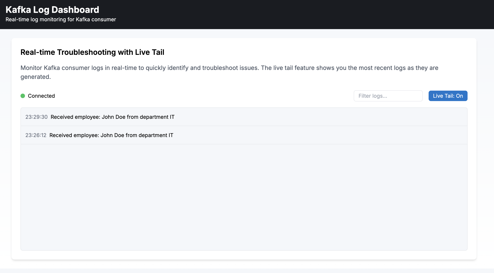

# Spring Cloud Stream with Kafka

This project demonstrates the use of Spring Cloud Stream with Kafka for building event-driven microservices. It includes a producer service, a consumer service, and a real-time dashboard for monitoring logs.

## Project Structure

- **kafka-producer**: A Spring Boot application that produces messages to a Kafka topic
- **kafka-consumer**: A Spring Boot application that consumes messages from a Kafka topic
- **dashboard**: A Next.js application for real-time monitoring of Kafka consumer logs

## Prerequisites

- Java 11 or higher
- Maven
- Docker and Docker Compose
- Node.js 18.17.0 or higher (for the dashboard)

## Getting Started

### Option 1: Using Docker Compose (Recommended)

Use Docker Compose to start all services (Kafka, Producer, Consumer, and Dashboard):

```bash
docker-compose up -d
```

This will:
1. Start Zookeeper and Kafka
2. Build and start the Kafka Producer service
3. Build and start the Kafka Consumer service
4. Build and start the Dashboard application

Once all services are running, you can access:
- The Producer API at http://localhost:8081
- The Consumer API at http://localhost:8082
- The Dashboard at http://localhost:3000

### Option 2: Manual Setup

If you prefer to run the services individually:

#### 1. Start Kafka

Use Docker Compose to start only Kafka:

```bash
docker-compose up -d zookeeper kafka
```

#### 2. Start the Producer and Consumer

Build and run the producer:

```bash
cd kafka-producer
mvn spring-boot:run
```

Build and run the consumer:

```bash
cd kafka-consumer
mvn spring-boot:run
```

#### 3. Start the Dashboard

```bash
cd dashboard
npm install
npm run dev
```

Open [http://localhost:3000](http://localhost:3000) in your browser to see the dashboard.

## Using the Application

1. Send a message to the producer using curl or Postman:

```bash
curl -X POST http://localhost:8081/employees -H "Content-Type: application/json" -d '{"id":"1", "name":"John Doe", "department":"IT"}'
```

2. The consumer will receive the message and log it.

3. The dashboard will display the log in real-time.

## Dashboard Features

The dashboard provides real-time monitoring of Kafka consumer logs, inspired by Elastic's log monitoring features:

- Real-time log monitoring with live tail
- Search and filter logs
- Highlighting of search terms
- Connection status indicator

For more details about the dashboard, see the [dashboard README](dashboard/README.md).

### Dashboard Screenshot

Below is a screenshot of the dashboard in action:



## Redis Integration

The consumer service uses Redis as a data store for employee information:

- Redis is configured to run on localhost:6379 by default
- Employee data received from Kafka is automatically stored in Redis
- Each employee is stored with their name as the key and the serialized JSON as the value
- Redis configuration can be modified in the `kafka-consumer/src/main/resources/application.properties` file

## Employee API Endpoints

The consumer service provides the following REST API endpoints for retrieving employee data from Redis:

- `GET /api/employees` - Retrieves all employees stored in Redis
- `GET /api/employees/{name}` - Retrieves a specific employee by name

Example usage:

```bash
# Get all employees
curl http://localhost:8082/api/employees

# Get a specific employee
curl http://localhost:8082/api/employees/John%20Doe
```
